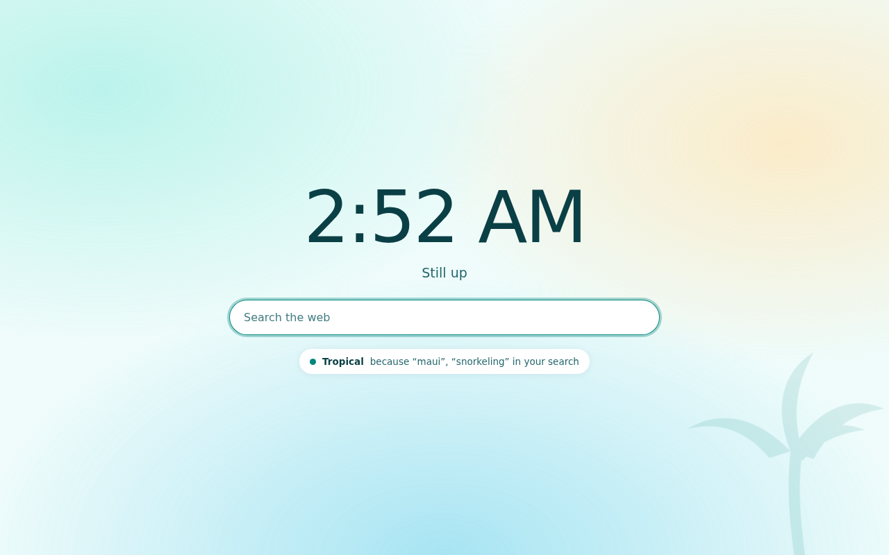
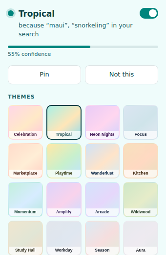
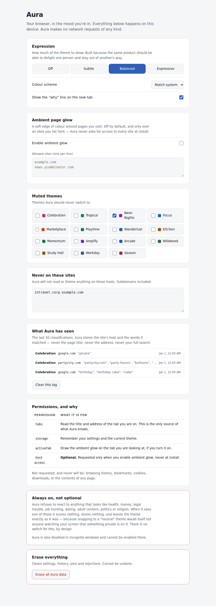

# Aura — Context-Aware Browser Theming

Your browser, in the mood you're in.

Search *"birthday cake ideas"* and the New Tab turns warm and festive. Plan a trip to Maui and
it turns sunlit and tropical. Open a pull request and it turns into a quiet, dark workspace.
All of it decided on your machine, from the tab title and address alone, with **no network
access of any kind**.



---

## Read this first: what Chrome actually allows

**Chrome has no runtime theme API.** Unlike Firefox's `browser.theme.update()`, an extension
cannot recolour the tab strip, toolbar or omnibox at runtime — Chrome themes are static,
packaged, and only one can be active. The naive version of this product is not buildable.

Aura is therefore built on the surfaces an extension genuinely owns:

| Surface | Themed? |
| --- | --- |
| **New Tab page** — the hero surface | ✅ fully |
| Popup and options | ✅ fully |
| Toolbar icon badge | ✅ tinted to the active theme |
| Web pages — soft ambient edge glow | ✅ opt-in, off by default, per-site |
| Tab strip / toolbar / omnibox | ❌ no API exists |

Full reasoning in [`docs/PRD.md`](docs/PRD.md) §3.

## The two experiences

**Ambient** — passive. Install it and forget it. The New Tab quietly matches what you're doing,
cross-fading between themes and never flickering.

**Studio** — active. The popup tells you *why* it chose a theme in one plain sentence
("Tropical — because 'maui', 'snorkeling' in your search"), and lets you pin it, reject it,
pick a different one, or switch the whole thing off in one click.

| Popup | Options |
| --- | --- |
|  |  |

## Privacy

This product reads what you browse. That is only acceptable if the contract is absolute:

- **Zero network.** No `fetch`, no beacons, no analytics. Enforced three ways: the manifest CSP
  (`connect-src 'none'`), a static scan in CI, and a runtime guard that makes the call throw.
- **Nothing leaves the device**, because nothing can.
- **Disabled in Incognito**, by manifest, permanently.
- **Sensitive-content firewall.** Health, money, legal trouble, job hunting, dating, adult
  content, politics and religion are never classified, never stored, never logged — and the
  theme is left *exactly as it was*. It does not snap to neutral, because snapping to neutral
  would itself tell anyone watching your screen that something private is on it. There is no
  switch to disable this.
- **Raw URLs are never persisted.** The activity log keeps the host and the matched words only.
- **No host permissions at install.** Access is requested only if you turn on ambient glow.
- **One-click erase** of everything.

## Status: 0.9.0 beta

Feature-complete against the v1 PRD, verified end-to-end in real Chrome, and packaged.
Pre-1.0 because classification quality is still being tuned against real browsing — it will
show you a neutral page rather than a wrong one, and that trade is set conservatively for now.

See [`CHANGELOG.md`](CHANGELOG.md) and [`store/LISTING.md`](store/LISTING.md) for the
Chrome Web Store submission package.

## Install (unpacked)

```bash
git clone <this repo> && cd chromeuseractivitytheme
```

1. Open `chrome://extensions`
2. Enable **Developer mode**
3. **Load unpacked** → select the `src/` directory
4. Open a new tab

No build step. No bundler. No dependencies. `src/` is the extension.

## Build a release

```bash
npm run build     # validates, then writes dist/aura-<version>.zip
npm run verify    # builds, then loads THAT zip in real Chrome and smoke-tests it
```

`build` refuses to package anything that would fail review: a version mismatch, a missing
referenced file, install-time host permissions, a weakened CSP, or a network call in any
source file.

## Develop

```bash
npm test              # 158 assertions, unit + integration, zero dependencies
npm run test:e2e      # 17 assertions against real Chrome with the extension loaded
npm run test:all      # both
npm run test:visual   # renders every page in Chromium (needs playwright)
```

The end-to-end suite loads the extension into real Chrome and browses, with
`--host-resolver-rules` mapping every hostname to a local server — so it sees genuine hosts
like `github.com` while no packet leaves the machine.

### Adding a theme

A theme is a **data-only** change — no engine edits, enforced by a test:

1. Add a category to `src/core/taxonomy.js` (keywords, host priors, negative keywords).
2. Add a matching entry to `src/core/themes.js` (light + dark palettes, motif, description).

`npm test` will fail if the two files disagree, if any palette misses WCAG AA, or if any
engine file starts hard-coding your category name.

## How it works

```
tab event → sanitise URL (drop query, hash, credentials, port)
          → SENSITIVE? → abort: score nothing, store nothing, change nothing
          → classify (weighted keywords + host priors, with negatives)
          → muted / rejected on this host? → drop
          → accumulate evidence with a 2-minute half-life
          → hysteresis: floor · margin · staleness · dwell · rate limit
          → theme change → persist, tint badge, broadcast
```

The classifier is deterministic and explainable on purpose: the popup has to justify itself in
one sentence, and a bundled model cannot do that. See
[`docs/PRD-REVIEW.md`](docs/PRD-REVIEW.md) A-01 for the trade-off and the upgrade path.

## Documentation

| Document | What it is |
| --- | --- |
| [`docs/PRD.md`](docs/PRD.md) | The product requirements, v1.1 |
| [`docs/PRD-REVIEW.md`](docs/PRD-REVIEW.md) | Gap review of the PRD: 11 gaps, 10 closed, 1 accepted |
| [`docs/ARCHITECTURE.md`](docs/ARCHITECTURE.md) | Module contracts, MV3 lifecycle, permission justification |
| [`docs/TESTING.md`](docs/TESTING.md) | Test strategy, and the bugs testing actually caught |
| [`PRIVACY.md`](PRIVACY.md) | The privacy policy, in plain terms |
| [`CHANGELOG.md`](CHANGELOG.md) | Release notes |
| [`store/LISTING.md`](store/LISTING.md) | Chrome Web Store listing copy, permission justifications, submission steps |

## Layout

```
src/
  manifest.json           MV3, minimal permissions, connect-src 'none'
  core/                   pure logic — no chrome.*, no clocks, fully testable in Node
    taxonomy.js           data: 15 categories, sensitive patterns, search engines
    text.js               normalisation and host matching
    privacy.js            the firewall + URL redaction
    classifier.js         the swappable decision seam
    scoring.js            decay and hysteresis (pure reducer)
    themes.js             16 palettes, light + dark, WCAG AA
    engine.js             pipeline orchestration
    storage.js            the only module that knows chrome.storage exists
  background/             thin MV3 shell — event wiring only
  newtab/ popup/ options/ the UI surfaces
  content/                the opt-in ambient overlay
```

## License

MIT — see [`LICENSE`](LICENSE).
